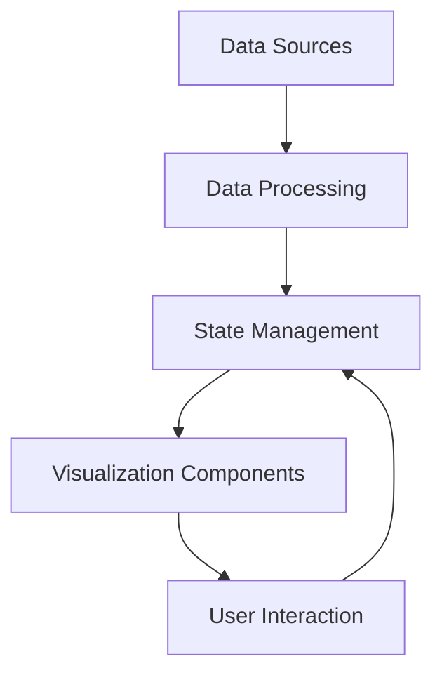

# Technical Specification: Interactive Elements

## 1. Overview
This document outlines the technical specifications for interactive elements in the LongevityCoach application, focusing on the Personal Journey and Health Metrics Dashboard.

## 2. Component Architecture

### 2.1 Health Metrics Dashboard


### 2.2 Component Hierarchy
- `App`
  - `DashboardLayout`
    - `HealthMetricsDashboard`
      - `MetricCard` (reusable)
      - `TimeSeriesChart`
      - `ProgressTracker`
    - `PersonalJourney`
      - `TimelineView`
      - `JournalEntry`
      - `MediaGallery`

## 3. Data Models

### 3.1 Health Metric
```typescript
interface HealthMetric {
  id: string;
  userId: string;
  type: 'bmi' | 'body_fat' | 'cholesterol' | 'blood_pressure' | 'blood_glucose';
  value: number;
  unit: string;
  date: Date;
  notes?: string;
  source: 'manual' | 'device' | 'lab';
}
```

### 3.2 Journal Entry
```typescript
interface JournalEntry {
  id: string;
  userId: string;
  date: Date;
  title: string;
  content: string;
  mood: number; // 1-5 scale
  tags: string[];
  mediaUrls?: string[];
  metrics?: {
    metricId: string;
    value: number;
  }[];
}
```

## 4. API Endpoints

### 4.1 Health Metrics
- `GET /api/metrics?type=&startDate=&endDate=`
- `POST /api/metrics`
- `PUT /api/metrics/:id`
- `DELETE /api/metrics/:id`

### 4.2 Journal Entries
- `GET /api/journal?startDate=&endDate=`
- `POST /api/journal`
- `PUT /api/journal/:id`
- `DELETE /api/journal/:id`

## 5. State Management

### 5.1 Redux Store Structure
```typescript
{
  metrics: {
    items: HealthMetric[];
    loading: boolean;
    error: string | null;
  },
  journal: {
    entries: JournalEntry[];
    loading: boolean;
    error: string | null;
  },
  ui: {
    selectedDateRange: {
      start: Date;
      end: Date;
    },
    activeMetric: string | null;
    viewMode: 'day' | 'week' | 'month' | 'year';
  }
}
```

## 6. Interactive Features

### 6.1 Health Metrics Dashboard
- **Real-time Updates**: WebSocket connection for live data
- **Responsive Design**: Adapts to mobile/desktop views
- **Export Options**: CSV/PDF export functionality
- **Custom Date Ranges**: Flexible time period selection

### 6.2 Personal Journey
- **Interactive Timeline**: Scrollable, zoomable timeline view
- **Rich Media Support**: Image/video upload and display
- **Tagging System**: Categorize entries with custom tags
- **Mood Tracking**: Visual mood indicators

## 7. Performance Considerations

### 7.1 Data Loading
- Implement pagination for journal entries
- Virtualized lists for large datasets
- Data caching with SWR/React Query

### 7.2 Rendering Optimization
- Memoize expensive calculations
- Use React.memo for pure components
- Implement windowing for long lists

## 8. Security

### 8.1 Authentication
- JWT-based authentication
- Role-based access control
- Session management

### 8.2 Data Protection
- Encryption at rest and in transit
- Regular security audits
- Rate limiting and DDoS protection

## 9. Testing Strategy

### 9.1 Unit Tests
- Component rendering
- Redux reducers
- Utility functions

### 9.2 Integration Tests
- API endpoints
- State management
- Component interactions

### 9.3 E2E Tests
- User flows
- Cross-browser testing
- Performance testing

## 10. Accessibility

### 10.1 WCAG Compliance
- Keyboard navigation
- Screen reader support
- Color contrast ratios
- ARIA labels

### 10.2 Performance Metrics
- First Contentful Paint < 1.5s
- Time to Interactive < 3s
- CLS < 0.1

## 11. Dependencies

### 11.1 Core
- React 18+
- TypeScript 5.0+
- Next.js 14+
- Redux Toolkit
- React Query

### 11.2 Visualization
- Recharts
- D3.js (for complex visualizations)
- Date-fns (date manipulation)

## 12. Future Enhancements
- AI-powered insights
- Integration with wearables
- Community features
- Advanced analytics

---
*Last Updated: 2025-06-11*
*Version: 1.0.0*
