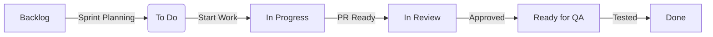

# Software Development Life Cycle: GitHub Sprint Management

## Overview
This document outlines the SDLC process for managing sprints in GitHub, integrated with Windsurf planning system. It defines the workflow, roles, and best practices for effective sprint execution.

## 1. Sprint Planning

### 1.1 Pre-Planning

- **Inputs**: Product backlog, previous sprint retrospective, team velocity
- **Tools**: GitHub Projects, Milestones, Labels
- **Process**:
  - Product Owner prioritizes backlog items
  - Team reviews and estimates stories (using story points)
  - Define sprint goal and success metrics
  - Create/update project board for the sprint

### 1.2 Sprint Setup

```bash
# Create new milestone for sprint
gh api --method POST /repos/OWNER/REPO/milestones \
  -f title="Sprint X: [Goal]" \
  -f state="open" \
  -f description="Sprint goal and key deliverables" \
  -f due_on="YYYY-MM-DD"
```

## 2. Sprint Execution

### 2.1 Daily Workflow

1. **Standup**: Review board, move cards, identify blockers
2. **Development**:
   - Create feature branches from `main`
   - Reference issue numbers in commits
   - Open Draft PRs for early feedback
3. **Code Review**:
   - Request reviews from team members
   - Use GitHub's review tools
   - Require at least one approval

### 2.2 GitHub Project Board



## 3. Code Quality & CI/CD

### 3.1 Automated Checks

- Linting (ESLint, Prettier)
- Unit tests (Jest/Vitest)
- E2E tests (Cypress/Playwright)
- Security scanning (CodeQL)

### 3.2 GitHub Actions Workflow

```yaml
name: CI/CD Pipeline
on:
  push:
    branches: [ main ]
  pull_request:
    branches: [ main ]

jobs:
  test:
    runs-on: ubuntu-latest
    steps:
      - uses: actions/checkout@v3
      - uses: actions/setup-node@v3
      - run: npm ci
      - run: npm run test
      - run: npm run build
```

## 4. Sprint Review

### 4.1 Demo Preparation

- Update documentation
- Prepare demo scripts
- Test in staging environment

### 4.2 Review Meeting

- Demo completed work
- Gather stakeholder feedback
- Update product backlog

## 5. Sprint Retrospective

### 5.1 Data Collection

- Velocity metrics
- Burndown chart
- Deployment frequency
- Lead time for changes

### 5.2 Retrospective Template

1. What went well?
2. What could be improved?
3. Action items for next sprint

## 6. Tools & Integrations

### 6.1 GitHub Features

- Projects (Kanban boards)
- Milestones
- Labels & Projects
- Actions (CI/CD)
- Code scanning

### 6.2 Recommended Integrations

- ZenHub for enhanced agile
- Sentry for error tracking
- Vercel/Netlify for previews
- Linear for advanced issue tracking

## 7. Best Practices

### 7.1 Branching Strategy

```text
main (protected)
└── feature/
    ├── feature/ABC-123-description
    └── bugfix/ABC-124-fix-issue
```

### 7.2 Commit Messages

- Use conventional commits
- Reference issue numbers
- Keep commits atomic

### 7.3 PR Guidelines

- Clear title and description
- Link to related issues
- Include screenshots for UI changes
- Update documentation

## 8. Monitoring & Improvement

### 8.1 Metrics to Track

- Cycle time
- Deployment frequency
- Change failure rate
- MTTR (Mean Time To Recovery)

### 8.2 Continuous Improvement

- Regular process reviews
- Experiment with new GitHub features
- Team training on best practices

## Last Updated

2025-06-11
