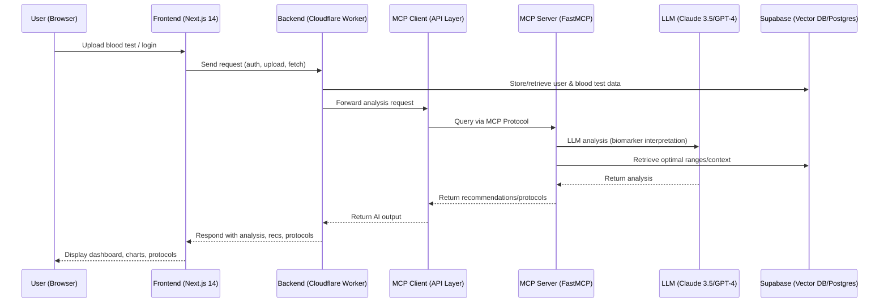

# Healthcare Longevity Platform - System Patterns

> **Last Updated:** 2025-06-02  
> **Version:** 2.0.0  
> **Status:** Active  

This document outlines the architectural patterns, technology standards, and implementation guidelines for the 
Healthcare Longevity Platform.

## Architecture Overview

### Core Stack

- **Frontend**: TypeScript/React with Next.js 14
- **State Management**: React Query + Zustand
- **API Layer**: Next.js API Routes
- **Database**: Supabase with TimescaleDB extension
- **AI/ML**: FastMCP for model serving
- **Compliance**: FHIR R4, HIPAA, GDPR

### Key Characteristics

- **Standards-Based**: Full compliance with HL7 FHIR R4, LOINC, and SNOMED CT
- **Cloud-Native**: Built on Supabase with automatic scaling and high availability
- **Security-First**: End-to-end encryption, audit logging, and role-based access control
- **Performance-Optimized**: Sub-50ms query response times for patient data
- **Extensible**: Modular design supporting future enhancements

## Technology Standards

### Required Technologies

- TypeScript 5.0+ with strict mode
- React 18+ with functional components and hooks
- Next.js 14+ with App Router
- Tailwind CSS for styling
- React Hook Form for form handling
- Zod for schema validation

### Prohibited Technologies

- jQuery
- Angular
- Emotion CSS
- Any non-TypeScript code
- Class components (except where required by libraries)

## Implementation Guidelines

### Data Layer

1. **Database**
   - Use Supabase RLS (Row Level Security) for all data access
   - Implement proper indexing for all query patterns
   - Use TimescaleDB for time-series health data
   - Follow FHIR R4 data models for healthcare data

2. **API Layer**
   - RESTful endpoints following FHIR standards
   - Version all endpoints (e.g., `/api/v1/...`)
   - Implement proper error handling and status codes
   - Rate limiting and request validation

### Frontend Architecture

1. **Component Structure**
   - Feature-based organization
   - Atomic design principles
   - Server Components by default, Client Components only when necessary
   - Proper loading and error states

2. **State Management**
   - Server state: React Query
   - Client state: Zustand
   - URL state: Next.js router
   - Form state: React Hook Form

### Security Requirements

1. **Authentication**
   - JWT with short expiration (15m)
   - Refresh tokens with rotation
   - Multi-factor authentication for admin access
   - Session management and invalidation

2. **Data Protection**
   - Field-level encryption for PHI
   - Data masking in development
   - Audit logging for all data access
   - Regular security audits

## Performance Targets

| Metric | Target | Current | Status |
|--------|--------|---------|--------|
| API Response Time | <50ms | TBD | 🔄 |
| Page Load | <2s | TBD | 🔄 |
| MCP Token Usage | <1000 tokens/request | TBD | 🔄 |
| Bundle Size | <150KB (gzipped) | TBD | 🔄 |
| Database Query | <10ms | TBD | 🔄 |

## Compliance Requirements

### HIPAA Compliance

- [ ] Data encryption at rest (AES-256)
- [ ] Data encryption in transit (TLS 1.3+)
- [ ] Access controls and audit logging
- [ ] Business Associate Agreement (BAA) with all vendors
- [ ] Regular security risk assessments

### GDPR Compliance

- [ ] Data minimization
- [ ] Right to be forgotten
- [ ] Data portability
- [ ] Consent management
- [ ] Data Protection Impact Assessments (DPIAs)

## Development Workflow

### Branch Strategy

- `main` - Production-ready code
- `develop` - Integration branch
- `feature/*` - New features
- `bugfix/*` - Bug fixes
- `release/*` - Release preparation

### Code Review Process

1. Create feature branch from `develop`
2. Open draft PR early for feedback
3. Request reviews from at least one team member
4. All tests must pass
5. Update documentation
6. Squash and merge

## Monitoring and Observability

### Required Metrics

- API response times
- Error rates
- Resource utilization
- User sessions
- Feature usage

### Alerting

- PagerDuty integration for critical alerts
- Slack notifications for warnings
- Daily digest of system health

## Documentation Requirements

### Required Documentation

- API documentation (OpenAPI/Swagger)
- Architecture Decision Records (ADRs)
- Runbooks for common operations
- Incident response playbooks
- Compliance documentation

### Documentation Standards

- Use Markdown format
- Keep documentation up-to-date
- Include examples and diagrams
- Document assumptions and limitations

## Deployment Strategy

### Environments

1. **Development**
   - For active development
   - Auto-deployed on push to feature branches

2. **Staging**
   - Mirrors production
   - Manual deployment from `develop`
   - Used for QA and UAT

3. **Production**
   - Manual deployment from `main`
   - Zero-downtime deployments
   - Feature flags for gradual rollouts

### Rollback Plan

- Automated health checks
- Database migration rollback scripts
- Blue-green deployment strategy
- Traffic shifting capabilities

## Incident Response

### Severity Levels

1. **SEV-1**: Complete system outage
2. **SEV-2**: Major functionality impacted
3. **SEV-3**: Minor issues with workarounds
4. **SEV-4**: Cosmetic or low-impact issues

### Response Process

1. Acknowledge the incident
2. Assemble response team
3. Mitigate impact
4. Resolve root cause
5. Document post-mortem
6. Implement preventive measures

## Future Considerations

### Technical Debt

- [ ] Implement GraphQL API layer
- [ ] Add real-time updates with WebSockets
- [ ] Enhance monitoring with OpenTelemetry
- [ ] Implement A/B testing framework

### Scalability

- Database sharding strategy
- CDN integration for static assets
- Edge computing for global performance
- Caching strategy optimization

---
*Document generated on 2025-06-02 - Keep this document updated as the system evolves.*

## Coding Patterns

- **Type Safety**: All business logic and UI components are implemented in TypeScript, ensuring strict type safety and 
reducing runtime errors.
- **Feature-Based Structure**: Components, hooks, and stores are organized by feature domain (e.g., auth, blood-tests, 
analysis) for scalability and maintainability.
- **Atomic Design**: UI components follow atomic design principles (atoms, molecules, organisms) using shadcn/ui and 
Tailwind CSS for consistency.
- **State Management**: Zustand is used for lightweight, composable state management, with selectors for efficient 
re-renders.
- **Form Handling**: Forms leverage React Hook Form and Zod for schema validation, ensuring robust user input handling.
- **Data Visualization**: Recharts is used for biomarker and trend visualization, with JetBrains Mono font for data 
clarity.
- **Accessibility**: All components are built to WCAG 2.1 AA standards with keyboard navigation and high-contrast 
support.
- **Testing**: Jest, React Testing Library, MSW, Playwright, and Chromatic are used for unit, integration, E2E, and 
visual regression testing.

## Architectural Patterns

- **Frontend**: Next.js 14 (React 18, PWA, TypeScript) for SSR, routing, and offline support. Feature-based folder 
structure and code splitting for performance.
- **Backend**: Cloudflare Workers for scalable, low-latency API endpoints. Supabase Postgres for secure, HIPAA-ready 
data storage.
- **AI Infrastructure**: MCP Protocol (FastMCP) mediates between frontend and LLMs (Claude 3.5 Sonnet or GPT-4) for 
blood analysis, recommendations, and protocol generation. Vector DB (Supabase) for semantic retrieval.
- **Security**: OAuth 2.1 for authentication, with future HIPAA compliance, Mixpanel, and Sentry for analytics and 
monitoring.
- **Data Flow**: All sensitive data encrypted in transit and at rest. API endpoints validate and sanitize all inputs.

## Sequence Diagram: User Journey (Blood Test Analysis)



## Technical Decision Rationale & Validation

- **Next.js 14 + React 18**: Enables hybrid SSR/SSG and PWA support, improving SEO, performance, and offline access. 
TypeScript enforces type safety and maintainability.
- **Cloudflare Workers**: Chosen for scalable, low-latency edge compute. Enables secure, fast API endpoints globally.
- **Supabase (Postgres + Vector DB)**: Provides secure, scalable, and HIPAA-ready storage, with vector search for 
semantic retrieval and personalized recommendations.
- **MCP Protocol (FastMCP)**: Abstracts AI agent orchestration, enabling modular, cost-efficient, and explainable 
LLM-powered analysis.
- **LLMs (Claude 3.5/GPT-4)**: Used for biomarker interpretation, protocol generation, and personalized 
recommendations. Both support advanced reasoning and medical context.
- **Security**: OAuth 2.1 is industry standard for authentication. All sensitive data is encrypted at rest and in 
transit. HIPAA, Mixpanel, and Sentry are planned for compliance, analytics, and monitoring.

**Validation**: This stack is modern, scalable, and aligns with the needs of a longevity-focused health platform. All 
major decisions are based on proven patterns in health tech, with a focus on security, compliance, and user experience.

## 1. System Overview

### 1.1 Purpose

This document provides detailed technical specifications for implementing a blood test analysis system based on 
healthcare interoperability standards (FHIR, LOINC, SNOMED CT) using Supabase as the backend infrastructure.

### 1.2 Scope

The system will:
- Store and process blood test results in standardized formats
- Provide real-time trend analysis and anomaly detection
- Ensure HIPAA compliance and data security
- Enable seamless integration with existing healthcare systems
- Support time-series analytics for longitudinal patient monitoring

### 1.3 Architecture Principles

- **Standards-Based**: Full compliance with HL7 FHIR R4, LOINC, and SNOMED CT
- **Cloud-Native**: Built on Supabase with automatic scaling and high availability
- **Security-First**: End-to-end encryption, audit logging, and role-based access control
- **Performance-Optimized**: Sub-50ms query response times for patient data
- **Extensible**: Modular design supporting future enhancements

## 2. Technical Architecture

### 2.1 System Components

#### 2.1.1 Database Layer (Supabase/PostgreSQL)

- **Primary Database**: PostgreSQL 15+ with TimescaleDB extension
- **Replication**: Multi-region setup with read replicas
- **Backup Strategy**: Point-in-time recovery + daily automated backups
- **Security**: Row Level Security (RLS) policies, encryption at rest

#### 2.1.2 API Layer

- **Framework**: Supabase PostgREST with custom functions
- **Authentication**: JWT-based with role-based access control
- **Rate Limiting**: 1000 requests/minute per authenticated user
- **Documentation**: OpenAPI 3.0 specification with interactive docs

#### 2.1.3 Integration Layer

- **FHIR Server**: Custom middleware for FHIR resource handling
- **LOINC Mapper**: Automated mapping service with 95%+ accuracy
- **HL7 Interface**: Support for HL7 v2 and FHIR message processing
- **Real-time Sync**: WebSocket connections for live data updates

### 2.2 Data Model

#### 2.2.1 Core Tables Structure

```sql
-- Patient demographics table
CREATE TABLE patients (
    id UUID PRIMARY KEY DEFAULT gen_random_uuid(),
    fhir_id TEXT UNIQUE,
    birth_date DATE,
    gender TEXT CHECK (gender IN ('male', 'female', 'other', 'unknown')),
    created_at TIMESTAMPTZ DEFAULT NOW(),
    updated_at TIMESTAMPTZ DEFAULT NOW()
);

-- LOINC codes reference table
CREATE TABLE loinc_codes (
    code TEXT PRIMARY KEY,
    long_common_name TEXT NOT NULL,
    component TEXT,
    property TEXT,
    timing TEXT,
    system TEXT,
    scale TEXT,
    method_type TEXT,
    reference_min NUMERIC,
    reference_max NUMERIC,
    unit TEXT,
    created_at TIMESTAMPTZ DEFAULT NOW()
);

-- Population-specific reference ranges
CREATE TABLE reference_ranges (
    id UUID PRIMARY KEY DEFAULT gen_random_uuid(),
    loinc_code TEXT REFERENCES loinc_codes(code),
    age_min INTEGER,
    age_max INTEGER,
    gender TEXT,
    population TEXT DEFAULT 'general',
    reference_min NUMERIC NOT NULL,
    reference_max NUMERIC NOT NULL,
    unit TEXT NOT NULL,
    source TEXT,
    created_at TIMESTAMPTZ DEFAULT NOW()
);

-- Main blood tests time-series table (hypertable)
CREATE TABLE blood_tests (
    id UUID PRIMARY KEY DEFAULT gen_random_uuid(),
    patient_id UUID REFERENCES patients(id),
    loinc_code TEXT REFERENCES loinc_codes(code),
    value NUMERIC NOT NULL,
    unit TEXT NOT NULL,
    reference_min NUMERIC,
    reference_max NUMERIC,
    interpretation TEXT CHECK (interpretation IN ('normal', 'high', 'low', 'critical')),
    specimen_type TEXT,
    collection_datetime TIMESTAMPTZ NOT NULL,
    result_datetime TIMESTAMPTZ DEFAULT NOW(),
    laboratory_id TEXT,
    device_id TEXT,
    fhir_observation_id TEXT,
    notes TEXT,
    created_at TIMESTAMPTZ DEFAULT NOW()
);

-- Convert to hypertable for time-series optimization
SELECT create_hypertable('blood_tests', 'result_datetime');
```

#### 2.2.2 Indexing Strategy

```sql
-- Performance-critical indexes
CREATE INDEX idx_blood_tests_patient_time ON blood_tests (patient_id, result_datetime DESC);
CREATE INDEX idx_blood_tests_loinc_time ON blood_tests (loinc_code, result_datetime DESC);
CREATE INDEX idx_blood_tests_collection_time ON blood_tests (collection_datetime);
CREATE INDEX idx_blood_tests_interpretation ON blood_tests (interpretation) WHERE interpretation != 'normal';

-- BRIN indexes for time-based partitioning
CREATE INDEX idx_blood_tests_time_brin ON blood_tests USING BRIN (result_datetime);
```

### 2.3 API Specifications

#### 2.3.1 REST API Endpoints

```yaml
openapi: 3.0.0
info:
  title: Blood Test Analysis API
  version: 1.0.0
  description: FHIR-compliant API for blood test data management

paths:
  /fhir/Observation:
    post:
      summary: Submit blood test observation
      requestBody:
        required: true
        content:
          application/fhir+json:
            schema:
              $ref: '#/components/schemas/Observation'
      responses:
        '201':
          description: Observation created successfully
        '400':
          description: Invalid FHIR resource
        '401':
          description: Unauthorized access

  /api/v1/patients/{patientId}/tests:
    get:
      summary: Get patient's blood test history
      parameters:
        - name: patientId
          in: path
          required: true
          schema:
            type: string
            format: uuid
        - name: loinc_code
          in: query
          schema:
            type: string
        - name: from_date
          in: query
          schema:
            type: string
            format: date-time
        - name: to_date
          in: query
          schema:
            type: string
            format: date-time
      responses:
        '200':
          description: Blood test results
          content:
            application/json:
              schema:
                type: array
                items:
                  $ref: '#/components/schemas/BloodTest'

  /api/v1/analytics/trends:
    post:
      summary: Analyze patient trends
      requestBody:
        required: true
        content:
          application/json:
            schema:
              type: object
              properties:
                patient_id:
                  type: string
                  format: uuid
                loinc_codes:
                  type: array
                  items:
                    type: string
                time_period:
                  type: string
                  enum: [7d, 30d, 90d, 1y]
      responses:
        '200':
          description: Trend analysis results
```

### 2.4 Security Specifications

#### 2.4.1 Authentication & Authorization

```sql
-- Row Level Security policies
CREATE POLICY patient_data_access ON blood_tests
    FOR ALL USING (
        patient_id = auth.uid() OR 
        auth.jwt() ->> 'role' = 'healthcare_provider'
    );

CREATE POLICY provider_full_access ON blood_tests
    FOR ALL USING (
        auth.jwt() ->> 'role' IN ('admin', 'laboratory_technician')
    );
```

#### 2.4.2 Data Encryption

- **At Rest**: AES-256 encryption for all database storage
- **In Transit**: TLS 1.3 for all API communications
- **Application Level**: Field-level encryption for PII data

#### 2.4.3 Audit Logging

```sql
-- Audit trail table
CREATE TABLE audit_log (
    id UUID PRIMARY KEY DEFAULT gen_random_uuid(),
    table_name TEXT NOT NULL,
    operation TEXT NOT NULL CHECK (operation IN ('INSERT', 'UPDATE', 'DELETE')),
    user_id UUID,
    old_values JSONB,
    new_values JSONB,
    timestamp TIMESTAMPTZ DEFAULT NOW(),
    ip_address INET,
    user_agent TEXT
);
```

## 3. Performance Requirements

### 3.1 Response Time Targets

- **Patient Data Query**: <50ms (99th percentile)
- **Trend Analysis**: <200ms for 1-year dataset
- **Data Ingestion**: <100ms per blood test record
- **FHIR Resource Validation**: <25ms per resource

### 3.2 Throughput Requirements

- **Concurrent Users**: 1,000+ healthcare providers
- **Data Ingestion Rate**: 10,000+ blood tests per minute
- **API Requests**: 100,000+ requests per hour
- **Real-time Subscriptions**: 500+ concurrent WebSocket connections

### 3.3 Scalability Specifications

```sql
-- Continuous aggregates for performance
CREATE MATERIALIZED VIEW monthly_patient_summaries
WITH (timescaledb.continuous) AS
SELECT 
    patient_id,
    loinc_code,
    time_bucket('1 month', result_datetime) AS month,
    AVG(value) AS avg_value,
    MIN(value) AS min_value,
    MAX(value) AS max_value,
    COUNT(*) AS test_count
FROM blood_tests
GROUP BY patient_id, loinc_code, month;

-- Retention policy for data lifecycle management
SELECT add_retention_policy('blood_tests', INTERVAL '7 years');
```

## 4. Integration Specifications

### 4.1 FHIR Compliance

#### 4.1.1 Supported Resources

- **Patient**: Demographics and identifiers
- **Observation**: Blood test results with LOINC codes
- **DiagnosticReport**: Grouped test results and interpretations
- **Organization**: Laboratory and healthcare provider information
- **Practitioner**: Healthcare provider details

#### 4.1.2 FHIR Profiles

```json
{
  "resourceType": "Observation",
  "status": "final",
  "category": [
    {
      "coding": [
        {
          "system": "http://terminology.hl7.org/CodeSystem/observation-category",
          "code": "laboratory",
          "display": "Laboratory"
        }
      ]
    }
  ],
  "code": {
    "coding": [
      {
        "system": "http://loinc.org",
        "code": "718-7",
        "display": "Hemoglobin [Mass/volume] in Blood"
      }
    ]
  },
  "subject": {
    "reference": "Patient/[patient-id]"
  },
  "effectiveDateTime": "2025-01-15T10:30:00Z",
  "valueQuantity": {
    "value": 14.2,
    "unit": "g/dL",
    "system": "http://unitsofmeasure.org",
    "code": "g/dL"
  },
  "referenceRange": [
    {
      "low": {
        "value": 12.0,
        "unit": "g/dL"
      },
      "high": {
        "value": 16.0,
        "unit": "g/dL"
      },
      "type": {
        "text": "Normal Range"
      }
    }
  ]
}
```

### 4.2 LOINC Integration

#### 4.2.1 Essential LOINC Codes Coverage

| Category | LOINC Code | Common Name | Unit |
|----------|------------|-------------|------|
| Hematology | 718-7 | Hemoglobin | g/dL |
| Hematology | 4544-3 | Hematocrit | % |
| Hematology | 6690-2 | White blood cell count | 10³/μL |
| Hematology | 777-3 | Platelet count | 10³/μL |
| Chemistry | 2345-7 | Glucose (random) | mg/dL |
| Chemistry | 1558-6 | Glucose (fasting) | mg/dL |
| Chemistry | 4548-4 | Hemoglobin A1c | % |
| Chemistry | 2160-0 | Creatinine | mg/dL |
| Lipids | 2093-3 | Total cholesterol | mg/dL |
| Lipids | 2085-9 | HDL cholesterol | mg/dL |
| Lipids | 13457-7 | LDL cholesterol | mg/dL |

#### 4.2.2 Automated Mapping Algorithm

```python
def map_to_loinc(test_name, specimen_type, method=None):
    """
    Automated LOINC mapping with 95%+ accuracy
    """
    # Normalize input
    normalized_name = normalize_test_name(test_name)
    
    # Primary mapping via exact match
    exact_match = loinc_db.query(
        normalized_name=normalized_name,
        specimen=specimen_type
    )
    
    if exact_match:
        return exact_match.loinc_code
    
    # Secondary mapping via fuzzy matching
    fuzzy_matches = loinc_db.fuzzy_search(
        text=normalized_name,
        threshold=0.85
    )
    
    # Apply method-specific filtering
    if method:
        fuzzy_matches = filter_by_method(fuzzy_matches, method)
    
    # Return best match with confidence score
    if fuzzy_matches:
        return {
            'loinc_code': fuzzy_matches[0].code,
            'confidence': fuzzy_matches[0].score,
            'manual_review': fuzzy_matches[0].score < 0.95
        }
    
    # Flag for manual review
    return {
        'loinc_code': None,
        'manual_review': True,
        'suggestions': get_similar_tests(normalized_name)
    }
```

## 5. Monitoring & Observability

### 5.1 Key Metrics

#### 5.1.1 System Health Metrics

- **Uptime**: Target 99.9% availability
- **Response Time**: P50, P95, P99 percentiles
- **Error Rate**: <0.1% for API requests
- **Database Performance**: Query execution times, connection pool usage

#### 5.1.2 Business Metrics

- **Data Quality**: LOINC mapping accuracy, validation error rates
- **User Adoption**: Active users, API usage patterns
- **Clinical Impact**: Trend detection effectiveness, alert accuracy

### 5.2 Alerting Strategy

```yaml
alerts:
  - name: high_error_rate
    condition: error_rate > 1%
    duration: 5m
    severity: critical
    
  - name: slow_response_times
    condition: p95_response_time > 100ms
    duration: 2m
    severity: warning
    
  - name: loinc_mapping_failures
    condition: mapping_accuracy < 90%
    duration: 10m
    severity: warning
    
  - name: hipaa_compliance_violation
    condition: unauthorized_access_attempt
    duration: 0s
    severity: critical
```

## 6. Deployment & Operations

### 6.1 Environment Configuration

#### 6.1.1 Production Environment

- **Compute**: Supabase Pro with dedicated resources
- **Database**: PostgreSQL with TimescaleDB, 4 CPU / 16GB RAM minimum
- **Storage**: 1TB SSD with automatic scaling
- **Backup**: Point-in-time recovery + daily snapshots
- **Monitoring**: Comprehensive logging and metrics collection

#### 6.1.2 Staging Environment

- **Purpose**: Pre-production testing and validation
- **Configuration**: Scaled-down version of production
- **Data**: Anonymized production data subset
- **Testing**: Automated CI/CD pipeline integration

### 6.2 Disaster Recovery

```yaml
disaster_recovery:
  rpo: 1 hour  # Recovery Point Objective
  rto: 4 hours  # Recovery Time Objective
  
  backup_strategy:
    frequency: continuous
    retention: 30 days
    geographic_distribution: multi-region
  
  failover_procedures:
    automatic: database_primary_failure
    manual: application_layer_issues
    testing: monthly_dr_drills
```

## 7. Compliance & Security

### 7.1 HIPAA Compliance Checklist

- [ ] Business Associate Agreement (BAA) signed
- [ ] Data encryption at rest and in transit
- [ ] Access controls and audit logging
- [ ] Employee training and certification
- [ ] Incident response procedures
- [ ] Regular security assessments
- [ ] Data retention and disposal policies

### 7.2 Quality Assurance

```sql
-- Data quality validation functions
CREATE OR REPLACE FUNCTION validate_blood_test_data()
RETURNS TRIGGER AS $$
BEGIN
    -- Validate LOINC code exists
    IF NOT EXISTS (SELECT 1 FROM loinc_codes WHERE code = NEW.loinc_code) THEN
        RAISE EXCEPTION 'Invalid LOINC code: %', NEW.loinc_code;
    END IF;
    
    -- Validate value is within reasonable range
    IF NEW.value <= 0 OR NEW.value > 1000000 THEN
        RAISE EXCEPTION 'Blood test value out of reasonable range: %', NEW.value;
    END IF;
    
    -- Validate collection time is not in future
    IF NEW.collection_datetime > NOW() THEN
        RAISE EXCEPTION 'Collection time cannot be in the future';
    END IF;
    
    RETURN NEW;
END;
$$ LANGUAGE plpgsql;

CREATE TRIGGER blood_test_validation
    BEFORE INSERT OR UPDATE ON blood_tests
    FOR EACH ROW EXECUTE FUNCTION validate_blood_test_data();
```

This comprehensive technical specification provides the foundation for implementing a robust, scalable, and compliant 
blood test analysis system using modern healthcare standards and cloud-native technologies.
